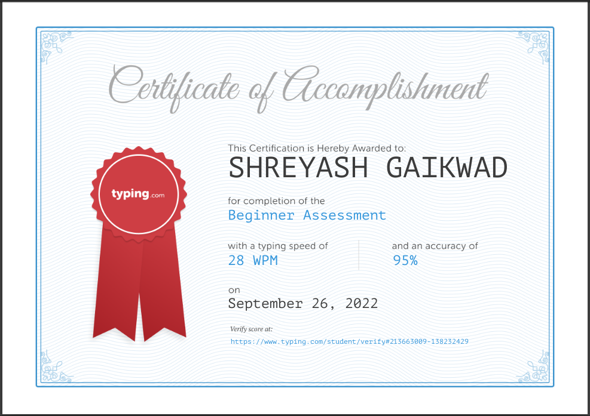

<h1 align="center">Typing-practice-Challenge</h1>
<h2 align="center">Day : 1</h2>
  
<h2 align="center">Day : 2</h2>
  
<h2 align="center">Day : 3</h2>
  
<h2 align="center">Day : 4</h2>
  
<h2 align="center">Day : 5</h2>
  
